# Challenge CIFAR-10 🚀

本项目旨在挑战 CIFAR-10 数据集，复现经典深度残差网络（ResNet）及其改进（如多尺度特征提取）的实验，同时引入现代 Vision Transformer (ViT) 模型对比实验，验证不同模型在 CIFAR-10 数据集上的性能，并尝试 SOTA 模型以探索其极限表现。通过系统的实验对比，探讨深度学习模型在小型数据集上的适用性及优化策略。

---

## 项目结构 📂

```
.
├── checkpoints                # 训练过程中保存的模型权重
│   ├── Plain18_checkpoint.pth             # Plain18 模型权重
│   ├── Plain34_checkpoint.pth             # Plain34 模型权重
│   ├── ResNet18_checkpoint.pth            # ResNet18 模型权重
│   ├── ResNet34_checkpoint.pth            # ResNet34 模型权重
│   ├── ResNet18WithMS_checkpoint.pth      # ResNet18 with MS 模型权重
│   ├── vit_tiny_checkpoint.pth            # ViT-tiny (预训练) 模型权重
│   ├── vitn_tiny_checkpoint.pth           # ViT-tiny (无预训练) 模型权重
│   └── custom_vit_checkpoint.pth          # 自定义 ViT 模型权重
│
├── configs                    # 配置文件
│   ├── config.yaml                       # Plain 和 ResNet 模型配置文件
│   ├── config_vit.yaml                   # Vision Transformer 模型配置文件
│   └── config_sota.yaml                  # SOTA 模型配置文件
│
├── data                       # 数据集文件夹
│   ├── cifar-10-batches-py               # CIFAR-10 数据集 (解压后的文件)
│   └── cifar-10-python.tar.gz            # CIFAR-10 数据集 (压缩包)
│
├── log                        # 训练日志，记录每个 epoch 的损失和验证错误率
│   ├── Plain18_log.txt                   # Plain18 模型训练日志
│   ├── Plain34_log.txt                   # Plain34 模型训练日志
│   ├── ResNet18_log.txt                  # ResNet18 模型训练日志
│   ├── ResNet34_log.txt                  # ResNet34 模型训练日志
│   ├── ResNet18WithMS_log.txt            # ResNet18 with MS 模型训练日志
│   ├── vit_tiny_log.txt                  # ViT-tiny (预训练) 模型训练日志
│   ├── vitn_tiny_log.txt                 # ViT-tiny (无预训练) 模型训练日志
│   ├── custom_vit_log.txt                # 自定义 ViT 模型训练日志
│   └── sota_log.txt                      # SOTA 模型训练日志
│
├── models                     # 模型定义文件夹
│   ├── __init__.py                      # 初始化文件
│   ├── plainnet.py                      # Plain 网络定义
│   ├── resnet.py                        # ResNet 网络定义
│   └── resnet_multiscale.py             # ResNet with MS 网络定义
│
├── paper                      # 相关论文文档
│   ├── An Image is Worth 16x16 Words Transformers for Im.pdf  # ViT 参考论文
│   ├── Deep Residual Learning for Image Recognition.pdf       # ResNet 参考论文
│   └── How to train your ViT.pdf                              # ViT 训练指南
│
├── plots                      # 实验生成的对比图
│   ├── training_and_validation_loss_comparison_Plain18_Plain34.png
│   ├── training_and_validation_loss_comparison_ResNet18_ResNet34.png
│   ├── training_and_validation_loss_ResNet18WithMS.png
│   ├── training_and_validation_loss_Vit-tiny-Pre-Training.png
│   ├── training_and_validation_loss_comparison_vit-tiny-p_vit-tiny-n_vit-tiny-c.png
│   ├── validation_error_comparison_Plain18_Plain34.png
│   ├── validation_error_comparison_ResNet18_ResNet34.png
│   ├── validation_error_ResNet18WithMS.png
│   ├── validation_error_Vit-tiny-Pre-Training.png
│   └── validation_error_comparison_vit-tiny-p_vit-tiny-n_vit-tiny-c.png
│
├── utils                      # 辅助工具和脚本
│   ├── timm_utils.py                    # Vision Transformer 辅助工具
│   ├── utils.py                         # 通用工具函数
│   └── custom_train_vit.py              # 自定义 ViT 训练脚本
│
├── train.py                   # Plain 和 ResNet 模型训练脚本
├── train_ms.py                # ResNet18 with MS 模型训练脚本
├── train_vit.py               # ViT 模型训练脚本
├── custom_train_vit.py        # 自定义 ViT 模型训练脚本
├── SOTA.py                    # SOTA 模型尝试脚本
└── .gitignore                 # Git 忽略文件

```

---

## 配置文件 🛠️

在 `configs/` 目录下包含以下配置文件：

1. **ResNet 和 Plain 网络** (`config.yaml`)：
   ```yaml
   epochs: 150
   batch_size: 256
   learning_rate: 0.1
   ```

2. **ViT 模型** (`config_vit.yaml`)：
   ```yaml
   model: vit_tiny_patch16_224
   pretrained: true
   epochs: 150
   batch_size: 512
   learning_rate: 0.0001
   ```

3. **SOTA 模型** (`config_sota.yaml`)：
   ```yaml
   model: eva02_large_patch14_448.mim_m38m_ft_in22k_in1k
   pretrained: true
   epochs: 50
   batch_size: 256
   learning_rate: 0.0001
   ```

---

## 实验启动 🚦

### ResNet 和 Plain 网络

```bash
# 训练 Plain18 网络
python train.py --model Plain18 --device cuda:3

# 训练 ResNet18 网络
python train.py --model ResNet18 --device cuda:6

# 训练 ResNet18 with MS 网络
python train_ms.py --model ResNet18WithMS --device cuda:7
```

### ViT 网络

```bash
# ViT (预训练权重)
python train_vit.py --config configs/config_vit.yaml --pretrained True

# ViT (无预训练权重)
python train_vit.py --config configs/config_vit.yaml --pretrained False

# 自定义 ViT 模型
python custom_train_vit.py
```

### SOTA 模型尝试

```bash
python SOTA.py --config configs/config_sota.yaml
```

---

## 实验结果与分析 📊

### 1. ResNet 和 Plain 网络实验

#### 验证错误率排名：
1. **ResNet18 with MS** - 引入多尺度特征提取后的网络效果最优，验证错误率最低。
2. **ResNet34** - 深层 ResNet 表现优于浅层 ResNet18。
3. **ResNet18** - 浅层 ResNet 网络表现较好，但低于 ResNet34 和 ResNet18 with MS。
4. **Plain18** - 浅层 Plain 网络的验证错误率低于 Plain34。
5. **Plain34** - 深层 Plain 网络表现最差，验证了深度网络的退化问题。

#### 图表与分析：
- **Plain18 与 Plain34**：
  - **训练与验证损失曲线**：
    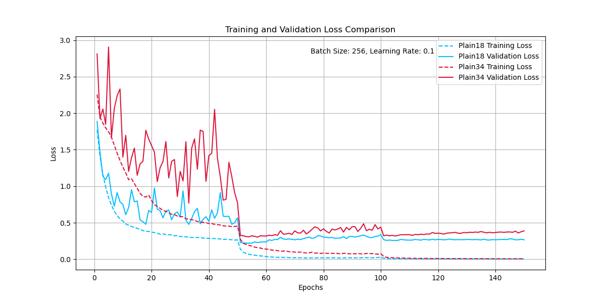
  - **验证错误率曲线**：
    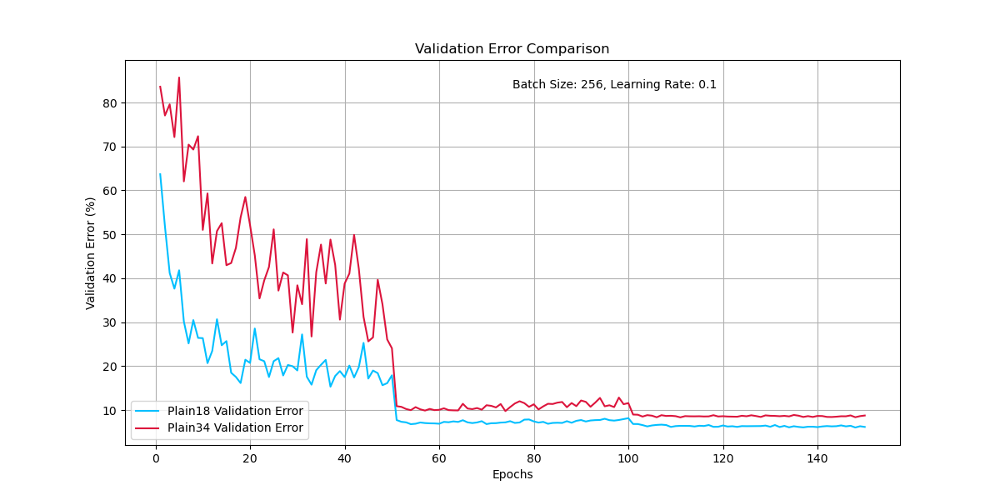

    **分析**：
    - Plain 网络在深层结构中（Plain34）表现出明显的退化问题，即验证错误率随深度增加而升高，训练误差逐步降低但验证误差未改善。
    - 这验证了 ResNet 论文中提到的深度退化问题，强调了残差连接的重要性。

- **ResNet18 与 ResNet34**：
  - **训练与验证损失曲线**：
    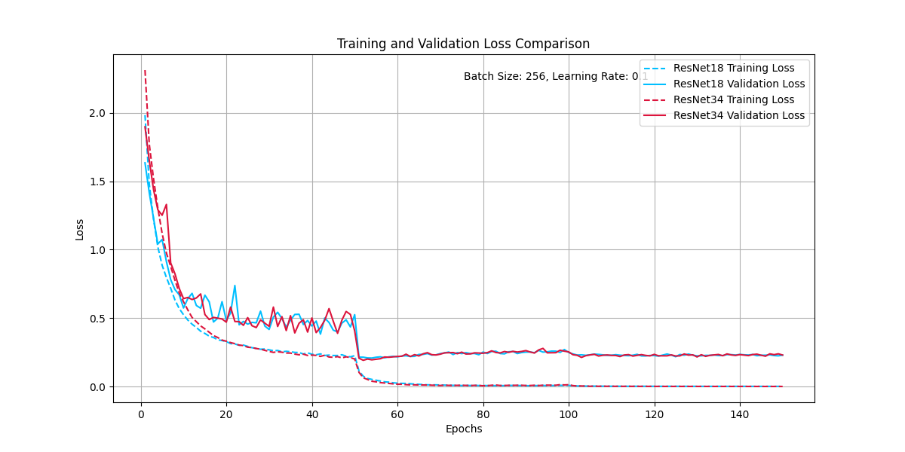
  - **验证错误率曲线**：
    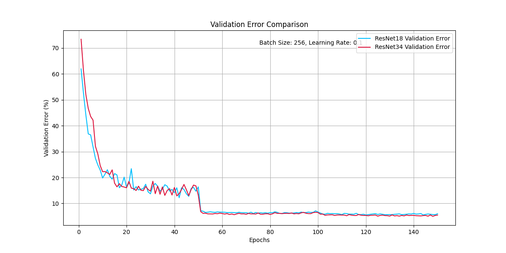

    **分析**：
    - ResNet 的引入有效缓解了深度退化问题，ResNet34 的性能优于 ResNet18，验证了更深层网络（结合残差连接）的优势。

- **ResNet18 with MS**：
  - **训练与验证损失曲线**：
    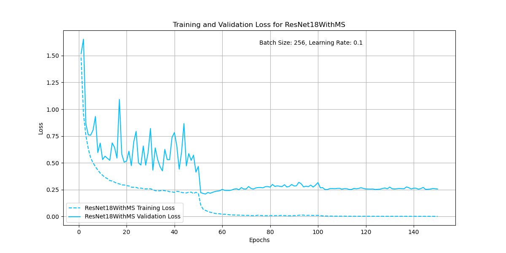
  - **验证错误率曲线**：
    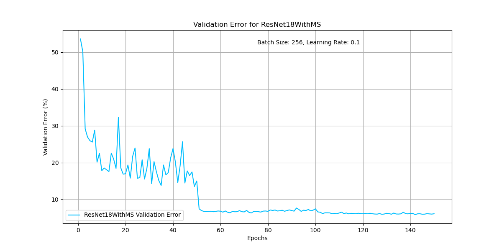

    **分析**：
    - 引入多尺度特征提取策略后，ResNet18 的验证错误率进一步降低，其性能接近甚至超过了 ResNet34。
    - 多尺度特征提取增强了浅层网络的表达能力，使其在 CIFAR-10 等小型数据集上表现尤为出色。

---

### 2. Vision Transformer (ViT) 实验

#### 验证错误率排名：
1. **ViT-tiny (预训练)** - 收敛速度最快，验证错误率仅 **2.68%**，性能最佳。
2. **ViT-tiny (无预训练)** - 验证错误率 **24.39%**，比预训练模型显著更高，训练时间长且收敛较慢。
3. **自定义 ViT** - 验证错误率为 **31.03%**，性能不及标准 ViT，但为验证新架构提供了实验平台。

#### 图表与详细分析：

- **ViT-tiny (预训练) 与 ViT-tiny (无预训练)**：
  - **训练与验证损失曲线**：
    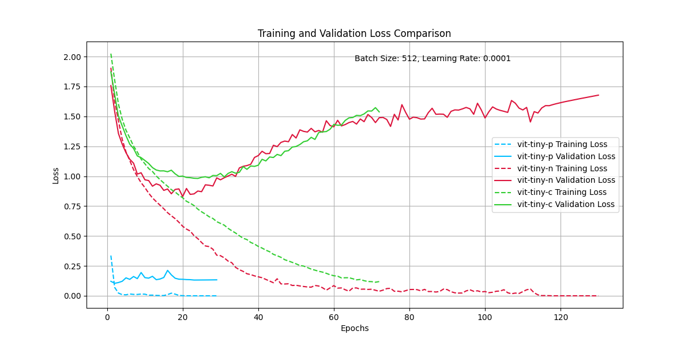
  - **验证错误率曲线**：
    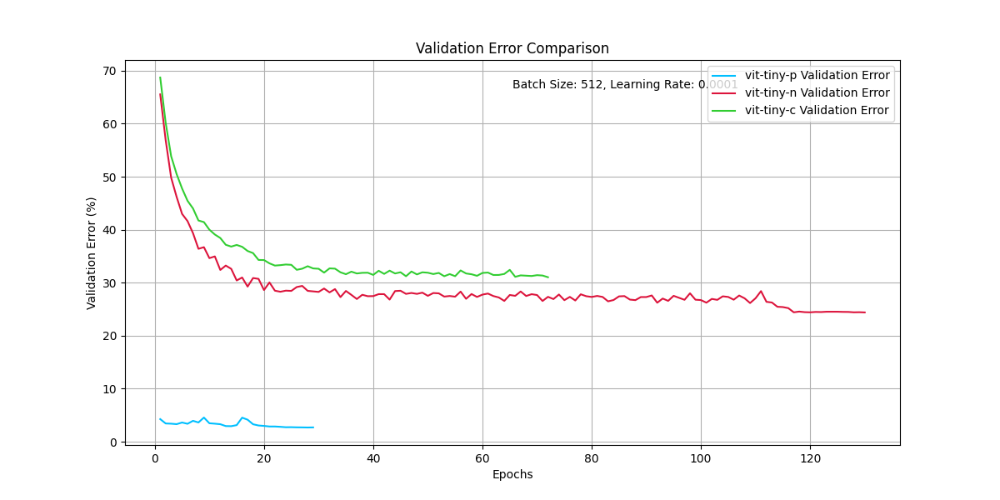

  **详细分析**：
  1. **预训练模型 (ViT-tiny-p)**：
     - **验证错误率最低**：快速下降到 **2.68%**，验证了迁移学习的有效性。
     - **收敛速度快**：在不到 10 个 epoch 内，模型达到稳定状态。
     - **现象与结论**：预训练权重在小型数据集（CIFAR-10）上显著缩短了训练时间并提升了模型性能。

  2. **无预训练模型 (ViT-tiny-n)**：
     - **收敛速度较慢**：训练和验证损失的下降曲线均较平缓，表明模型对数据集适应需更长时间。
     - **过拟合问题显著**：训练误差快速下降，但验证误差维持较高水平，表明模型在数据规模有限的情况下难以充分泛化。

  3. **自定义 ViT 模型 (ViT-tiny-c)**：
     - **训练和验证损失曲线**：
       
     - **分析**：验证错误率维持在 **31.03%**，性能不及标准 ViT，但由于架构简洁，适合快速验证实验假设。

---

#### **ViT-tiny (预训练) 的单独分析**

- **训练与验证损失曲线**：
  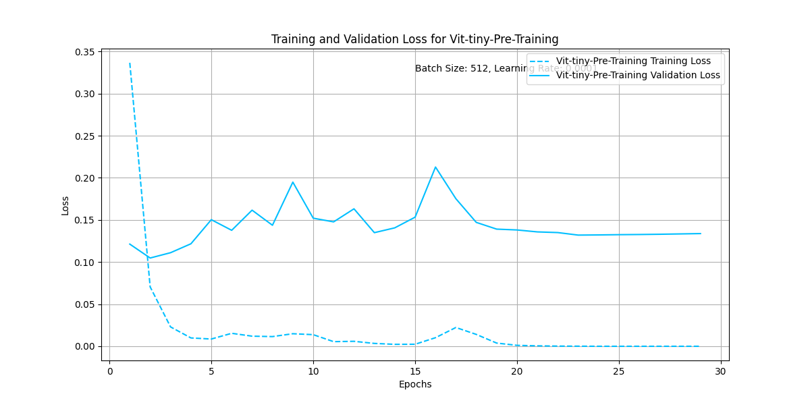
  
  **分析**：
  - **损失曲线的变化**：在训练初期，训练和验证损失迅速下降，并在短时间内趋于平稳，表明模型训练稳定且收敛速度快。
  - **迁移学习的效果**：预训练权重在小型数据集上实现了良好的迁移效果，使得训练误差与验证误差非常接近，无明显的过拟合现象。
  - **总结**：预训练显著降低了 ViT-tiny 的训练时间，同时提高了模型的泛化能力，是小型数据集上的关键优化手段。

---

## Recap ✨

### KeyPoints：

1. **残差网络的有效性**：
   - ResNet 系列（特别是引入多尺度特征提取后的 ResNet18）在缓解深层网络退化问题上具有显著优势。
   - **多尺度特征提取** 提升了浅层网络的性能，是一种高效的优化策略。

2. **Vision Transformer 的表现**：
   - **预训练权重是小型数据集上的关键**：显著缩短了训练时间，同时极大提升了模型性能。
   - 无预训练的 ViT 收敛较慢，泛化性能有限。

---
### 展望未来

本项目展示了在 CIFAR-10 数据集上经典网络（如 ResNet）与现代网络（如 ViT）在特定实验设置下的表现。通过分析和对比，我们获得了许多洞察，尤其是在模型深度、特征提取策略、预训练效果方面的影响。然而，随着模型复杂度的增加，数据规模的扩大以及领域需求的变化，深度学习模型的未来发展依然充满挑战和机遇。

---

#### 图像处理模型的 SOTA 展望

当前顶尖的图像处理模型已经在大规模数据集（如 ImageNet）上取得了极高的准确率，验证了最新模型架构的强大特征提取能力。下图展示了当前在图像分类领域 SOTA 模型的性能对比：

- **图像处理 SOTA 模型性能对比**：
  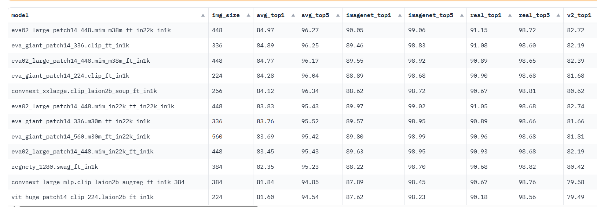

**分析**：
- 模型如 **eva02_large_patch14_448.mim_m38m_ft_in22k_in1k** 和 **convnext_xxlarge.clip_laion2b_soup_ft_in1k** 在 ImageNet 上的 Top-1 和 Top-5 准确率非常接近理论上限，达到了 90% 以上的准确率。
- **模型复杂度**：
  - 更大的输入尺寸（如 448x448）通常带来更高的准确率，但同时也增加了推理计算的复杂度。
  - 模型如 **eva_giant_patch14_336.clip_ft_in1k**，尽管参数量更高，但在一些任务中的表现不一定优于轻量化设计的模型。

**未来方向**：
- **计算效率与模型轻量化**：通过稀疏注意力机制、知识蒸馏等技术，提升模型在边缘设备或资源受限环境下的适用性。
- **多模态融合**：结合视觉与语言的特征表示，如当前 CLIP 模型展示的潜力，将可能在视觉理解的泛化能力上更进一步。

---

#### 大型语言模型（LLM）的新趋势

在大型语言模型（LLM）领域，当前的 SOTA 模型也达到了新的技术高度。下图展示了当前排名靠前的 LLM 模型：

- **LLM 模型对比**：
  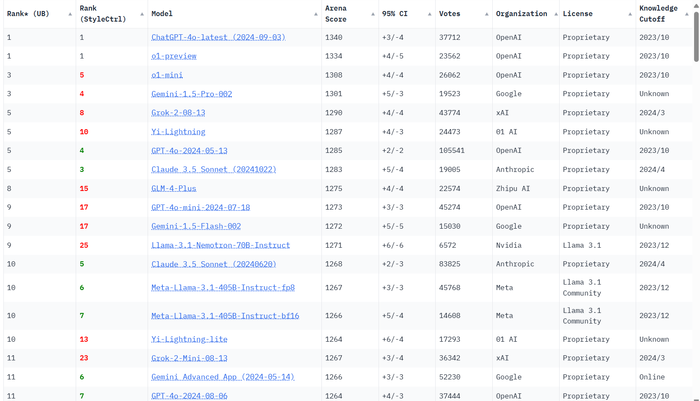

**分析**：
- **ChatGPT-4 最新模型（ChatGPT-4.0-latest）**：
  - 作为 SOTA 的主导者，OpenAI 的最新模型凭借其高 Arena Score 和全面的表现，在广泛的任务中表现优越。
- **Gemini 系列**：
  - Google 推出的 **Gemini 1.5 Pro** 展现了强大的语言生成能力和跨模态处理能力。
- **Meta 的 Llama 3.1 系列**：
  - Llama 系列专注于社区共享的模型设计，提供了开源解决方案，是在研究和工业界的有效选择。

**未来方向**：
- **跨模态交互能力**：许多 LLM 正逐步整合视觉模块，支持图文生成、问答等多模态任务。
- **模型个性化与任务适应性**：通过少样本学习、增量训练等方式，使得 LLM 更加适应特定领域的需求。
- **计算资源优化**：如何在保持模型性能的前提下，减少模型的资源占用，优化训练和推理效率，将是未来的重要研究方向。

---

### 总结

通过图像处理与大型语言模型（LLM）两个领域的最新进展，我们可以看到，深度学习模型正朝着多模态融合、轻量化设计与高效计算方向发展。

